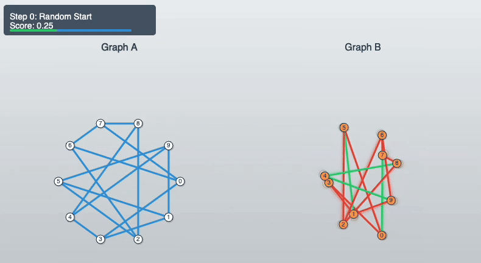
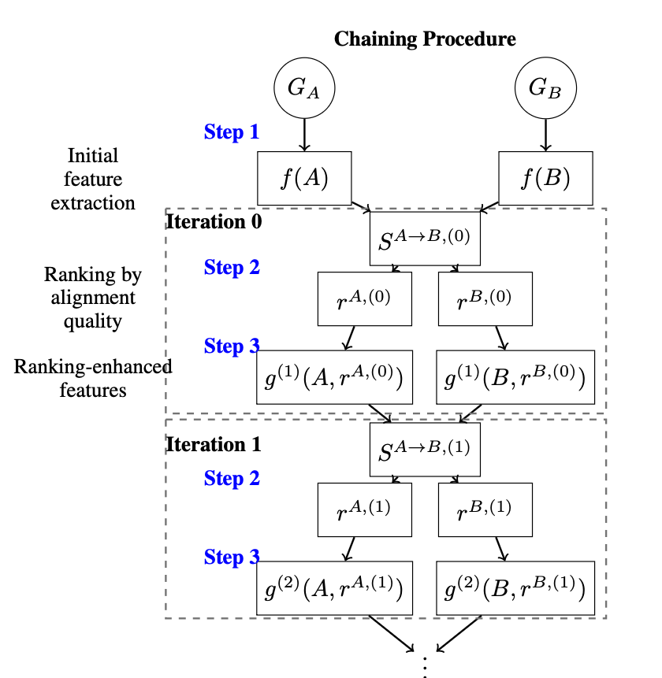

# Combinatorial Graph Alignment with Sequential GNNs

This repository contains the code for the paper [Bootstrap Learning for Combinatorial Graph Alignment with Sequential GNNs](https://arxiv.org/abs/2510.03086)

## The combinatorial Graph Alignment Problem (GAP)



Given two n×n adjacency matrices A and B, representing graphs G_A and G_B, the **graph alignment problem** aims to find the permutation π that best matches their structures by aligning corresponding edges. Formally, the objective is  
\pi(j)})


To evaluate the quality of an alignment, we define the **number of common edges** under a permutation π as  
=\frac12\sum_{i,j}A_{ij}B_{\pi(i)\pi(j)})

The factor of $1/2$ corrects for double-counting edges in undirected graphs.

## Chained FGNNs

Starting from input graphs G_A and G_B, we first (1) extract features and compute similarities, then iteratively (2) rank nodes by alignment quality, and (3) use rankings to enhance features and similarities.



## Performances on Synthetic datasets

Number of common edges (higher is better) for sparse Erdős-Rényi random graphs: 
| noise        | 0   | 0.05 | 0.1 | 0.15 | 0.2 | 0.25 | 0.3 | 0.35 |
|--------------|-----|------|-----|------|-----|------|-----|------|
| Proj(D_cx) | 997 | 950 | 853 | 499 | 195 | 130 | 115 | 112 |
| FAQ(D_cx)  | 997 | 950 | 898 | 847 | 723 | 504 | 487 | 485 |
| ChFGNN Proj | 997 | 950 | 898 | 845 | 790 | 694 | 503 | 319 |
| ChFGNN FAQ  | 997 | 950 | 899 | 849 | 800 | 730 | 626 | 534 |

Number of common edges (higher is better) for dense Erdős-Rényi random graphs: 

| noise        | 0     | 0.05  | 0.1   | 0.15  | 0.2   | 0.25  | 0.3   | 0.35  |
|--------------|-------|-------|-------|-------|-------|-------|-------|-------|
| Proj(D_cx) | 19964 | 18987 | 17966 | 8700  | 3888  | 3646  | 3633  | 3624  |
| FAQ(D_cx)  | 19964 | 18987 | 17968 | 16990 | 15972 | 7922  | 6272  | 6276  |
| ChFGNN Proj | 19964 | 18969 | 16241 | 13028 | 9561  | 6166  | 3615  | 3591  |
| ChFGNN FAQ  | 19964 | 18987 | 17968 | 16990 | 15779 | 11227 | 6258  | 6255  |

Number of common edges (higher is better) for regular random graphs:

| noise        | 0    | 0.05 | 0.1  | 0.15 | 0.2  |
|--------------|------|------|------|------|------|
| Proj(D_cx) | 51   | 51   | 50   | 49   | 50   |
| FAQ(D_cx)  | 385  | 425  | 456  | 369  | 496  |
| ChFGNN Proj | 2500 | 1343 | 563  | 192  | 114  |
| ChFGNN FAQ  | 2500 | 2059 | 1438 | 850  | 837  |


## Project Structure

```
chaining-gnn-graph-alignment/
├── models/              # Core model implementations
│   ├── pipeline.py      # Chaining and Streaming pipeline classes
│   ├── pl_model.py      # Siamese network (PyTorch Lightning)
│   └── layers.py        # Neural network layers
│   └── ...        
├── loaders/             # Data loading and generation
│   ├── data_generator.py   # Synthetic graph generation
│   └── ...              # Data loading utilities
├── toolbox/             # Utilities and metrics
│   ├── metrics.py       # QAP metrics and evaluation
│   ├── utils.py         # Helper functions
│   └── ...              # Baseline methods
├── conf/                # Hydra configuration files
│   ├── config.yaml      # Main config
│   ├── dataset/         # Dataset configurations
│   ├── model/           # Model configurations
│   ├── training/        # Training configurations
│   └── pipeline/        # Pipeline configurations
├── commander.py         # Main training script (chaining)
├── inference.py         # Inference script
```


## Citation

If you use this code in your research, please cite:

```bibtex
@article{lelarge2024bootstrap,
  title={Bootstrap Learning for Combinatorial Graph Alignment with Sequential GNNs},
  author={Lelarge, Marc and Others},
  journal={arXiv preprint arXiv:2510.03086},
  year={2024},
  url={https://arxiv.org/abs/2510.03086}
}
```


## Acknowledgments

We are grateful to the CLEPS infrastructure from the Inria of Paris for providing resources and support.
This project was provided with computing HPC and storage resources by GENCI at IDRIS thanks to the grant 2025-AD010613995R2 on the supercomputer Jean Zay's A100 and H100 partitions. 
