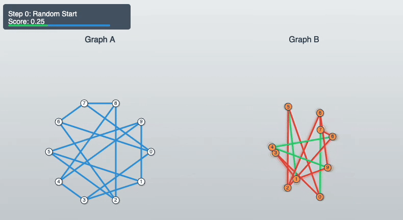
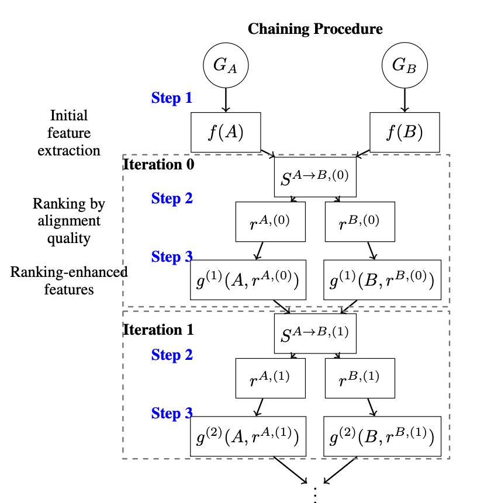
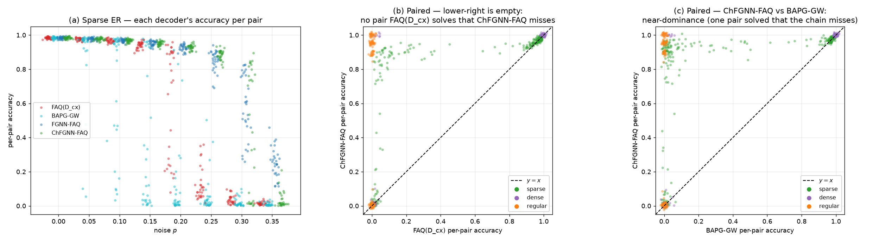

# Chaining 2-FWL GNNs for Combinatorial Graph Alignment

This repository contains the code for the paper [Chaining 2-FWL GNNs for Combinatorial Graph Alignment](https://arxiv.org/abs/2510.03086).

## The combinatorial Graph Alignment Problem (GAP)



Given two n×n adjacency matrices A and B, representing graphs G_A and G_B, the **graph alignment problem** aims to find the permutation π that best matches their structures by aligning corresponding edges. Formally, the objective is  
\pi(j)})


To evaluate the quality of an alignment, we define the **number of common edges** under a permutation π as  
=\frac12\sum_{i,j}A_{ij}B_{\pi(i)\pi(j)})

The factor of 1/2 corrects for double-counting edges in undirected graphs.

## Chained FGNNs

Starting from input graphs G_A and G_B, we first (1) extract features and compute similarities, then iteratively (2) rank nodes by alignment quality, and (3) use rankings to enhance features and similarities.



### The D_cx initialization (FAQ)

The classical **FAQ** solver is much stronger than recently reported once it is *initialized well*. We distinguish two initializations:

- **FAQ(J)** — FAQ started from the uninformative barycenter `J = 1·1ᵀ/n` (scipy's default).
- **FAQ(D_cx)** — FAQ started from the solution of the **convex** relaxation
  `min ‖A P − P B‖²_F` over doubly-stochastic matrices, solved by Frank–Wolfe.

The convex (`D_cx`) solver is isolated in [`toolbox/frank_wolfe.py`](toolbox/frank_wolfe.py)
(`relaxed_normAPPB_FW_seeds` / `solve_dcx`). The `FAQ(D_cx)`-vs-`FAQ(J)` gap is reproduced by
[`run_baseline.py`](run_baseline.py); chained FGNNs are then shown to improve on the strengthened
`FAQ(D_cx)` baseline.

## Installation

This project uses [uv](https://docs.astral.sh/uv/) for a reproducible environment (Python ≥ 3.12):

```bash
git clone <repo-url>
cd chaining-gnn-graph-alignment
uv sync            # creates .venv from the pinned uv.lock
```

Run scripts through the environment, e.g. `uv run python run_inference.py --help`, or activate the
venv with `source .venv/bin/activate`. A plain `pip install -e .` into a Python ≥ 3.12 environment
also works as a fallback. All inference below runs on **CPU/MPS** — no GPU required.

## Quickstart — reproduce a result with no GPU

Pretrained models are distributed as GitHub Releases and downloaded on demand.

```bash
# Synthetic (sparse Erdős–Rényi, avg degree 4):
python run_inference.py      --release v1.0.0-er500-d4-pn0.22

# Real-world (ca-netscience): build the test data once, then reproduce:
python -m repro.prepare_data --dataset ca-netscience --output-dir ./data
python run_inference_real.py --release v1.1.0-canetscience-pn0.1 --data-dir ./data
```

## Reproducing the paper results

Every results table maps to one `make` target — `make synthetic`, `make realworld`, or a single cell
like `make ca-netscience` (run `make help` for the list). The commands each target runs are below.

### Synthetic graphs

`run_inference.py` downloads a pretrained chained FGNN and runs the inference loop; `run_baseline.py`
computes the FAQ baselines on the same cached data.

```bash
python run_inference.py --release v1.0.0-er500-d4-pn0.22      # sparse ER (d=4)
python run_inference.py --release v1.0.0-er500-d80-pn0.24     # dense ER  (d=80)
python run_inference.py --release v1.0.0-reg500-d10-pn0.11    # regular   (d=10)

python run_baseline.py  --release v1.0.0-er500-d4-pn0.22      # FAQ(D_cx) vs FAQ(J) + Max-nce
```

### Real-world graphs

The three real-world benchmarks (yeast PPI, ca-netscience coauthorship, inf-euroroad road network)
ship as tiny raw edge lists under [`data/raw/`](data/raw/) (see [`data/raw/SOURCES.md`](data/raw/SOURCES.md)
for provenance and citations). `repro/prepare_data.py` turns them into the train/val/test parquet
pairs the pipeline consumes (two noise models, matching the paper); `run_inference_real.py` downloads
a pretrained model and reports `acc / nce`.

```bash
# 1. build the real-world datasets (all of them) from the committed raw edge lists:
python -m repro.prepare_data --all --output-dir ./data

# 2. reproduce a table cell (downloads the matching pretrained model):
python run_inference_real.py --release v1.1.0-canetscience-pn0.1 --data-dir ./data
python run_inference_real.py --release v1.1.0-euroroad-pn0.2     --data-dir ./data
python run_inference_real.py --release v1.1.0-yeast25lc-pn0.05   --data-dir ./data
python run_inference_real.py --release v1.1.0-multimagna         --data-dir ./data --test-name multimagna_yeast20_test
```

**Reproducibility / seeding.** The published numbers were produced with **no fixed seed** and a
**single noise realization** per cell, so the default (`--seed None`) matches the paper — expect small
run-to-run variation (the paper notes `nce` is the more reliable metric, as the base graphs have large
automorphism groups). Pass `--seed <int>` for a deterministic rebuild: the seed now drives **every**
random draw — the base graph (for synthetic), the edge add/remove noise, and the permutations.

- **Real-world:** `python -m repro.prepare_data --dataset … --seed 0` → identical parquets every run.
- **Synthetic:** `python run_inference.py --release … --seed 0` seeds the on-the-fly test-graph
  generation. Generated data is cached under `--data_dir`, so use a fresh `--data_dir` when changing
  the seed. (Inference itself is deterministic given the data on CPU; on GPU, fp16 may cause tiny
  variation, but `nce` is an integer edge count and is robust.)

### Pretrained checkpoints

| Release tag | Model |
|---|---|
| `v1.0.0-er500-d4-pn0.22` | ChFGNN-ER4 (sparse ER, also the real-world *transfer* model) |
| `v1.0.0-er500-d80-pn0.24` | ChFGNN, dense ER |
| `v1.0.0-reg500-d10-pn0.11` | ChFGNN, regular graphs |
| `v1.1.0-canetscience-pn0.1` / `-pn0.2` | ChFGNN, ca-netscience (noise 0.1 / 0.2) |
| `v1.1.0-euroroad-pn0.1` / `-pn0.2` | ChFGNN, inf-euroroad (noise 0.1 / 0.2) |
| `v1.1.0-yeast25lc-pn0.05` / `-pn0.1` | ChFGNN, yeast25LC (noise 0.05 / 0.1) |
| `v1.1.0-multimagna` | ChFGNN, MultiMAGNA yeast |

### Baselines (FAQ, FUGAL, SGWL)

`run_baseline.py` reproduces the in-repo FAQ baselines — **FAQ(D_cx)**, **FAQ(J)**, and the
**Max-nce** ceiling (FAQ seeded from the true permutation). The external baselines are **not**
vendored: **FUGAL** ([idea-iitd/Fugal](https://github.com/idea-iitd/Fugal), `mu=1`) and **SGWL**
(Xu et al., 2019) numbers come from their authors' code. Note that the FAQ numbers reported by some
prior work use the barycenter `J` initialization; initializing FAQ from the convex relaxation
(`FAQ(D_cx)`) already surpasses those.

## Training from scratch

Training uses [Hydra](https://hydra.cc/) configs in [`conf/`](conf/). By default, data and
checkpoints live under `~/experiments-gnn-gap/` (override with `root_dir=/path`).

```bash
python commander.py dataset=sparse                 # synthetic sparse ER
python commander.py dataset=ca_netscience          # real-world (after prepare_data)
```

## Results — synthetic graphs

Accuracy / number of common edges (`acc / nce`) as a function of the noise `p`. The numbers below are
**reproduced** with `make reproduce` (fixed seed 0; 30 test pairs per cell, 10 for dense) from the run in
[`repro/results/repro_seed0.jsonl`](repro/results/repro_seed0.jsonl), and reproduce the paper's Table.
`Proj` and `FAQ` are post-processing decoders; `FGNN` is a single network and `ChFGNN` the chained
variant. Regenerate the table with `make reproduce`; re-run the paper's settings with `make synthetic`.

**Sparse Erdős–Rényi, average degree 4** (nce_max ≈ 1000):

| p | 0 | 0.05 | 0.1 | 0.15 | 0.2 | 0.25 | 0.3 | 0.35 |
|---|---|---|---|---|---|---|---|---|
| Proj(D_cx) | 0.98/994 | 0.98/944 | 0.91/849 | 0.58/482 | 0.22/195 | 0.088/131 | 0.040/117 | 0.020/117 |
| FAQ(D_cx) | 0.98/994 | 0.97/945 | 0.97/895 | 0.94/841 | 0.64/683 | 0.12/499 | 0.037/484 | 0.015/481 |
| FGNN Proj | 1.00/994 | 0.88/792 | 0.69/512 | 0.52/314 | 0.38/196 | 0.29/135 | 0.22/95 | 0.16/72 |
| FGNN FAQ | 0.98/994 | 0.98/945 | 0.97/895 | 0.95/843 | 0.92/790 | 0.85/732 | 0.58/620 | 0.25/516 |
| ChFGNN Proj | 0.98/994 | 0.98/945 | 0.97/894 | 0.95/840 | 0.91/783 | 0.85/722 | 0.40/451 | 0.035/261 |
| ChFGNN FAQ | 0.98/994 | 0.98/945 | 0.97/895 | 0.95/843 | 0.93/792 | 0.88/744 | 0.44/608 | 0.033/520 |

**Dense Erdős–Rényi, average degree 80** (nce_max ≈ 20,000):

| p | 0 | 0.05 | 0.1 | 0.15 | 0.2 | 0.25 | 0.3 | 0.35 |
|---|---|---|---|---|---|---|---|---|
| Proj(D_cx) | 1.00/19906 | 1.00/18904 | 1.00/17882 | 0.67/9827 | 0.17/3975 | 0.049/3664 | 0.024/3646 | 0.012/3604 |
| FAQ(D_cx) | 1.00/19906 | 1.00/18904 | 1.00/17896 | 1.00/16912 | 1.00/15899 | 0.32/8854 | 0.014/6226 | 0.006/6218 |
| FGNN Proj | 1.00/19906 | 1.00/18891 | 0.80/12764 | 0.45/6228 | 0.26/4296 | 0.15/3677 | 0.094/3517 | 0.056/3417 |
| FGNN FAQ | 1.00/19906 | 1.00/18904 | 1.00/17896 | 1.00/16912 | 1.00/15899 | 1.00/14911 | 0.81/12365 | 0.12/6897 |
| ChFGNN Proj | 1.00/19906 | 1.00/18904 | 0.95/16584 | 0.82/12699 | 0.73/10333 | 0.49/7026 | 0.082/4278 | 0.014/4037 |
| ChFGNN FAQ | 1.00/19906 | 1.00/18904 | 1.00/17896 | 1.00/16912 | 1.00/15899 | 0.90/14050 | 0.22/7800 | 0.009/6272 |

**Regular graphs, degree 10** (nce_max = 2500):

| p | 0 | 0.05 | 0.1 | 0.15 | 0.2 |
|---|---|---|---|---|---|
| Proj(D_cx) | 0.002/51 | 0.002/51 | 0.002/51 | 0.002/50 | 0.002/50 |
| FAQ(D_cx) | 0.002/623 | 0.002/491 | 0.002/571 | 0.002/646 | 0.002/409 |
| FGNN Proj | 1.00/2500 | 0.40/465 | 0.16/133 | 0.085/82 | 0.068/72 |
| FGNN FAQ | 1.00/2500 | 0.95/2052 | 0.89/1693 | 0.10/849 | 0.032/834 |
| ChFGNN Proj | 1.00/2500 | 0.72/1329 | 0.27/518 | 0.005/296 | 0.004/290 |
| ChFGNN FAQ | 1.00/2500 | 0.96/2052 | 0.60/1416 | 0.003/865 | 0.003/869 |

> **Two caveats** for the reproduced numbers (fixed seed, reduced sample — close to but not bit-identical
> to the unseeded paper):
> 1. On **regular** graphs the convex relaxation is degenerate, so `Proj(D_cx)`/`FAQ(D_cx)` collapse to a
>    near-random alignment; their `nce` is high-variance and only approximate (this *is* the paper's point —
>    `ChFGNN` is what succeeds, `1.00/2500` at `p=0`).
> 2. At the **FAQ phase transition** (sparse ≈ 0.3, regular ≈ 0.1, dense ≈ 0.25–0.3) the single-network
>    `FGNN FAQ` row is bimodal and sample-sensitive — with the reduced sample it can sit above `ChFGNN` at a
>    cell. `ChFGNN` and `FAQ(D_cx)` reproduce stably across the sweep.

### Per-sample analysis (uncertainty & failure overlap)

The reproduction stores every method's **per-pair** `acc`/`nce` (not just the mean) in
[`repro/results/repro_seed0.jsonl`](repro/results/repro_seed0.jsonl), so the averages above carry
uncertainty and admit paired, instance-level comparison. `make tables CI=--ci` renders the full
`mean ± 95% CI` tables; the CIs are negligible everywhere except the **FAQ phase transition**, where they
are large and expose the bimodality the mean hides (e.g. `sparse@0.3` ChFGNN-FAQ `0.44 ± 0.13`).



*(a) Each decoder's per-pair accuracy on sparse ER: the transition is **bimodal** — pairs are either solved (≈1) or not (≈0) — which the mean averages over. (b) ChFGNN-FAQ vs FAQ(D_cx) on every synthetic pair: the **empty lower-right** is the dominance (no pair the baseline solves that ChFGNN misses), and the top-left cloud is the pairs ChFGNN rescues. Regenerate with `make plot` (needs `uv sync --extra viz`).*

Because sample index *i* is the **same graph pair** across methods, `make overlap`
([`repro/failure_overlap.py`](repro/failure_overlap.py)) compares them pair-by-pair:

- **ChFGNN-FAQ solves a strict superset of FAQ(D_cx)'s pairs.** In *every* cell it never fails a pair the
  convex baseline solves, and at the transition it solves many the baseline cannot (e.g. +30 of 30 at
  `sparse@0.25`, +20 of 30 at `regular@0.1`); the remaining hard pairs are common to both. This is a
  stronger, instance-level version of the mean curves.
- Against its own single-network ablation it is **not** dominant: `FGNN-FAQ` solves 27 transition pairs that
  `ChFGNN-FAQ` misses — the per-sample face of the phase-transition variance noted above.

A tidy long CSV (one row per cell/method/sample) is at
[`repro/results/samples.csv`](repro/results/samples.csv) (`make samples`) for further analysis.

## Results — real-world graphs

`acc / nce` (acc as %). `FAQ(D_cx)`, `ChFGNN-ER4`, `ChFGNN` and `Max nce` are **reproduced** with
`make reproduce` (seed 0); **ChFGNN-ER4** is the synthetic sparse-ER model transferred zero-shot
(`v1.0.0-er500-d4-pn0.22`), **ChFGNN** the dataset-specific model (the `v1.1.0-*` releases). FUGAL
([idea-iitd/Fugal](https://github.com/idea-iitd/Fugal), `mu=1`) and SGWL are **external** baselines, quoted
from the paper. Reproduce with `make realworld`.

**Noisy real-world networks** (edge add/remove noise; tab:realworld-noisy):

| Method | yeast25LC 5% | yeast25LC 10% | ca-netscience 10% | ca-netscience 20% | inf-euroroad 10% | inf-euroroad 20% |
|---|---|---|---|---|---|---|
| FUGAL | 53.1/7480 | 44.6/7035 | 60.3/794 | 37.7/629 | 18.3/818 | 2.9/714 |
| FAQ(D_cx) | 65.0/7873 | 57.0/7435 | 63.8/817 | 45.2/685 | 57.4/1174 | 15.5/972 |
| ChFGNN-ER4 | 48.3/7669 | 44.5/7279 | 63.5/814 | 46.0/690 | 39.7/1103 | 13.5/980 |
| ChFGNN | 60.3/7848 | 52.9/7416 | 67.2/821 | 59.3/725 | 59.7/1197 | 18.0/993 |
| Max nce | – /7918 | – /7511 | – /823 | – /733 | – /1269 | – /1142 |

**MultiMAGNA yeast PPI** (edge-addition low-confidence variants; tab:multimagna-full). "training" =
the variant used to train the dataset-specific ChFGNN (not a test cell):

| Method | 5% conf | 10% conf | 15% conf | 20% conf | 25% conf |
|---|---|---|---|---|---|
| FAQ(J) | 37.5/7383 | 34.4/7245 | 29.1/6807 | 23.9/6689 | 36.4/7383 |
| SGWL | 83.6/– | – | 66.6/– | – | 58.8/– |
| FUGAL | 83.0/8311 | 77.7/8231 | 74.3/8172 | 70.9/8148 | 68.6/8095 |
| FAQ(D_cx) | 84.2/8323 | 82.6/8317 | 78.0/8289 | 77.0/8294 | 76.1/8306 |
| ChFGNN-ER4 | 80.3/8300 | 75.3/8288 | 67.2/8252 | 63.1/8213 | 53.1/8080 |
| ChFGNN | training | training | training | 72.2/8300 | 69.8/8291 |

## Project Structure

```
chaining-gnn-graph-alignment/
├── models/                 # Core model implementations
│   ├── pipeline.py         # Chaining pipeline (training + inference loop)
│   ├── pl_model.py         # Siamese network (PyTorch Lightning)
│   └── ...                 # FGNN / message-passing layers
├── loaders/                # Data generation and loading
│   ├── generators.py       # Synthetic graph generation + ER noise model
│   ├── real_noise.py       # Real-graph noising helpers
│   └── ...
├── toolbox/                # Metrics, baselines, the D_cx solver
│   ├── frank_wolfe.py      # Convex (D_cx) Frank–Wolfe solver
│   ├── baselines.py        # FAQ baselines (evaluate_faq_inits: D_cx vs J vs Max-nce)
│   └── metrics.py          # Evaluation metrics
├── repro/                  # Reproduction tooling
│   └── prepare_data.py     # raw edge lists -> train/val/test parquets
├── conf/                   # Hydra configuration files (config, dataset, model, training, pipeline)
├── data/raw/               # Committed raw real-world edge lists (+ SOURCES.md)
├── Makefile                # One target per paper table (make help)
├── commander.py            # Training entry point (chaining)
├── run_inference.py        # Synthetic inference from a release
├── run_inference_real.py   # Real-world inference from a release
└── run_baseline.py         # FAQ baselines (D_cx vs J + Max-nce)
```

## Citation

If you use this code in your research, please cite:

```bibtex
@article{lelarge2025chaining,
  title={Chaining 2-FWL GNNs for Combinatorial Graph Alignment},
  author={Lelarge, Marc},
  journal={arXiv preprint arXiv:2510.03086},
  year={2025},
  url={https://arxiv.org/abs/2510.03086}
}
```

## Acknowledgments

We are grateful to the CLEPS infrastructure from the Inria of Paris for providing resources and support.
This project was provided with computing HPC and storage resources by GENCI at IDRIS thanks to the grant 2025-AD010613995R2 on the supercomputer Jean Zay's A100 and H100 partitions. 
